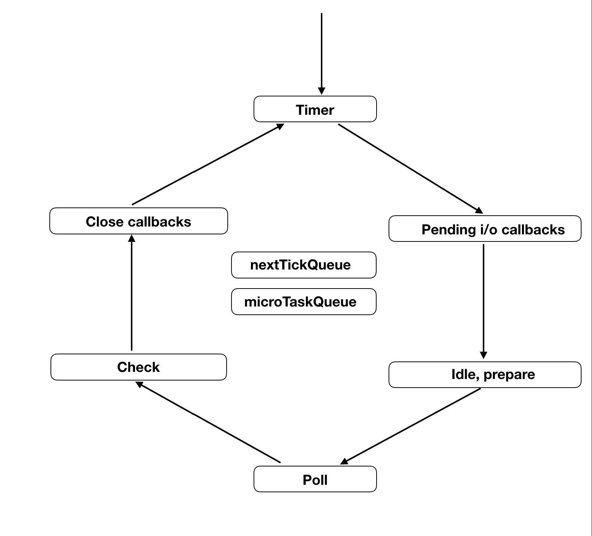

The event loop is a single-threaded loop designed to handle all the scheduling of your application code. By scheduling, it means that the event loop manages a queue of events that are used to trigger callbacks. As opposed to the common misunderstanding which says that the EL is part of the v8 engine, the event loop uses the JavaScript V8 engines to execute JavaScript code.

_source: https://www.voidcanvas.com/nodejs-event-loop_

The event loop is comprised of **several phases**, each with its own queue. The order of execution is shown above: Timer => Pending io callbacks => Idle, prepare (internal) => Poll => Check => Close callbacks. In each phase, node executes tasks until either the queue is exhausted or the system-dependent max limit is hit.

Additionally, there are two queues, outside of the event loop, which handle different types of callbacks (i.e., nextTick vs. promises). They get the highest priority and so are executed before the event loop starts.

setImmediate and process.nextTick: Which one runs first? The order of execution is a little tricky here, mostly due to the confusing name. `setImmediate()` is processed in the **Check** phase of the next iteration; `process.nextTick()` is processed at the **starting of the event loop** and **between each phase** of the event loop.

**References**

\- https://jinoantony.com/blog/setimmediate-vs-process-nexttick-in-nodejs

\- https://www.voidcanvas.com/nodejs-event-loop/
